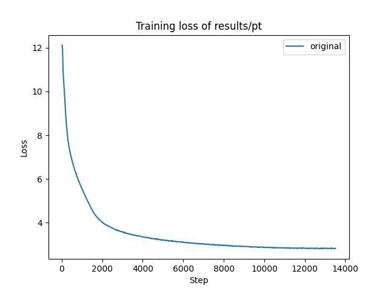
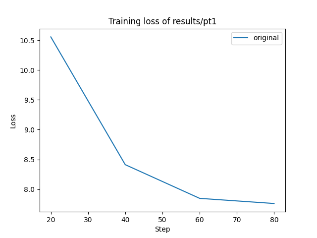
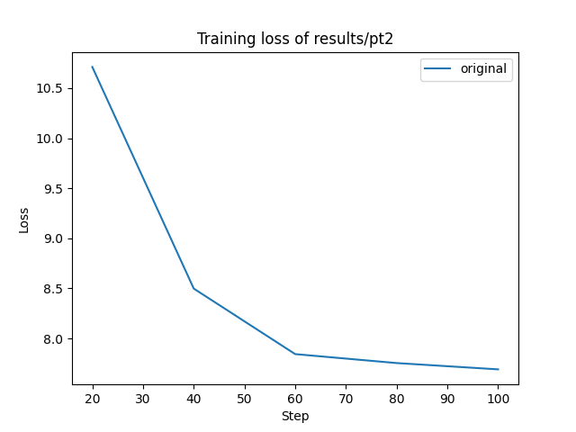
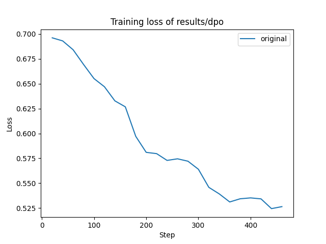
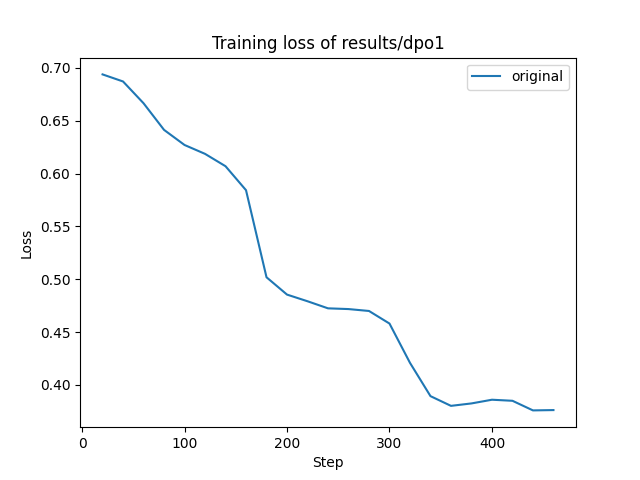
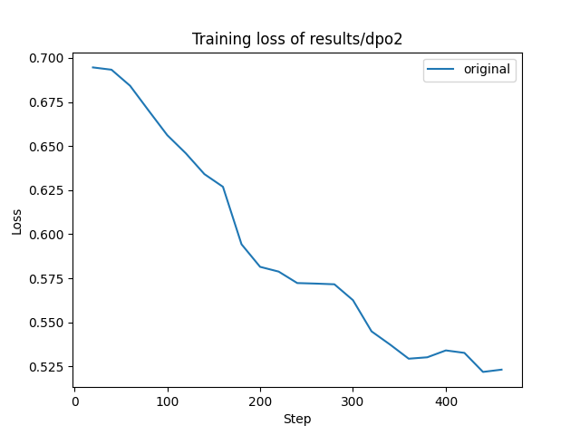
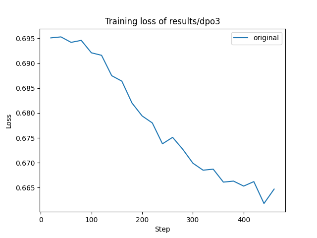

# mini_qwen

## 目录
- [简介](#简介)
- [快速开始](#快速开始)
- [模型下载链接](#模型下载链接)
- [数据集介绍](#数据集介绍)
- [训练流程](#训练流程)
- [结果分析与模型评估](#结果分析与模型评估)
- [猜你想问](#猜你想问)
- [总结](#总结)

## 简介
mini_qwen是一个从头开始训练的1B参数的大型语言模型(LLM)项目，包括预训练(PT)、微调(SFT)和直接偏好优化(DPO)3个部分。其中预训练和微调仅需要12G显存即可训练，直接偏好优化仅需要14G显存即可训练，这意味着使用T4显卡就可以开始你的训练之旅。  
mini_qwen是以Qwen2.5-0.5B-Instruct模型为基础，通过扩充模型隐藏状态层数、隐藏状态维度和注意力头数，增加参数量到1B，并进行参数随机初始化。训练数据使用北京智源人工智能研究院的预训练(16B token)、微调(9M 条)和偏好数据(60K 条)，使用flash_attention_2进行加速，使用deepspeed在6张H800上训练25h(pt 1epoch)、43h(sft 3epoch)、1h(dpo 3epoch)。  
这是一次非常有趣且有价值的尝试，在整个过程中，本项目探究了尺度定律(scaling law)与复读机现象，也解决了很多bug。本项目将尽可能详细地介绍整个训练过程，也欢迎交流讨论。

本项目主要参考以下项目和资料：  
- https://github.com/zhanshijinwat/Steel-LLM [数据来源]
- https://www.modelscope.cn/organization/BAAI [数据来源]
- https://github.com/jiahe7ay/MINI_LLM [代码流程]
- https://github.com/hiyouga/LLaMA-Factory [代码流程]
- https://www.bilibili.com/video/BV1azH1e8Ekf?spm_id_from=333.788.videopod.sections&vd_source=63b3850fa9262e89716266c278491604 [LLaMA-Factory调试debug]
- https://huggingface.co/docs [各种高级api，包括Trainer、TRL(SFTTrainer和DPOTrainer)、Accelerate]
- https://www.bilibili.com/video/BV1KX4y1a7Jk/?vd_source=63b3850fa9262e89716266c278491604 [Trainer、Accelerate教程]
- https://github.com/huggingface/trl/issues [TRL使用过程中各种问题]

## 快速开始
本项目构建了mini_data(通过utils/save_mini_data.py)，也下载了模型配置文件，如果只是体验模型训练流程，不需要额外下载数据集和模型，仅需要下载本项目到本地，然后运行预训练(pt)、微调(sft)和直接偏好优化(dpo)的demo_xx.py代码即可。
**注意：请确保安装以下python包：**
**pip install flash-attn**
**pip install trl==0.11.4**  
**pip install transformers==4.45.0** 
```bash
# 下载本项目
git clone https://github.com/qiufengqijun/mini_qwen.git
cd mini_qwen

# demo_xx.py和mini_qwen_xx.py基本一致，为了减少显存占用，进行了以下修改：
# 在demo/demo_xx.py中， 将data/替换为mini_data/
# 在demo/demo_xx.py中， 设置per_device_train_batch_size=1
# 在demo/demo_pt.py中， 设置block_size = 128
# 在demo/demo_sft.py中，设置max_seq_length=128
# 在demo/demo_dpo.py中，设置max_length=128 max_prompt_length=64

# 参考run.sh中的“单卡在命令行运行”
python demo/demo_pt.py
python demo/demo_sft.py
python demo/demo_dpo.py
```
## 模型下载链接
本项目将训练过程中的几乎所有模型都进行了保存，下载链接如下：
| 训练阶段 | 模型名称               | 下载链接                                                                      | 备注                 |
|---------|----------------------|------------------------------------------------------------------------------|---------------------|
| pt      | pt                   | [下载链接](https://huggingface.co/qiufengqijun/mini_qwen_pt)                  | 推荐模型              |
| pt      | pt1                  | [下载链接](https://huggingface.co/qiufengqijun/mini_qwen_pt1)                 | 常规方法 小型中文数据   |
| pt      | pt2                  | [下载链接](https://huggingface.co/qiufengqijun/mini_qwen_pt2)                 | 序列打包 小型中文数据   |
| pt      | pt3                  | [下载链接](https://huggingface.co/qiufengqijun/mini_qwen_pt3)                 | 常规方法 小型中英文数据 |
| sft     | sft_checkpoint-7730  | [下载链接](https://huggingface.co/qiufengqijun/mini_qwen_sft_checkpoint-7730) | 1epoch               |
| sft     | sft_checkpoint-15461 | [下载链接](https://huggingface.co/qiufengqijun/mini_qwen_sft_checkpoint-15461)| 2epoch 推荐模型       |
| sft     | sft                  | [下载链接](https://huggingface.co/qiufengqijun/mini_qwen_sft)                 | 3epoch               |
| dpo     | dpo_checkpoint-154   | [下载链接](https://huggingface.co/qiufengqijun/mini_qwen_dpo_checkpoint-154)  | 1epoch               |
| dpo     | dpo_checkpoint-309   | [下载链接](https://huggingface.co/qiufengqijun/mini_qwen_dpo_checkpoint-309)  | 2epoch               |
| dpo     | dpo                  | [下载链接](https://huggingface.co/qiufengqijun/mini_qwen_dpo)                 | 3epoch               |

## 数据集介绍
### 预训练数据
本项目参考[Steel-LLM的预训练数据搜集工作](https://zhuanlan.zhihu.com/p/687338497)，发现了[WuDao文本预训练数据集](https://data.baai.ac.cn/details/WuDaoCorporaText)，但是此数据集只能在网页下载，遂放弃。此数据集是由智源构建的，遂到魔塔搜索智源开源的数据集，找到了[IndustryCorpus2 30类行业分类的高质量预训练数据集](https://www.modelscope.cn/datasets/BAAI/IndustryCorpus2)，此数据集按照行业-中英文-数据质量进行分层，完美符合笔者对预训练数据集的期望，因此使用此数据集作为预训练数据集。

本项目从[IndustryCorpus2 30类行业分类的高质量预训练数据集](https://www.modelscope.cn/datasets/BAAI/IndustryCorpus2)中选择10个行业-中英文-高质量数据。其中数学-统计学、时政-政务-行政、计算机-通信、文学情感和影视娱乐行业的英文-高质量数据量过大，故对于这5个行业，只选择前3个文件的数据进行训练，实际使用数据量约为16B token。

| 路径                                                   | 原始数据 | 实际使用数据 |
|-------------------------------------------------------|----------|----------|
| mathematics_statistics/chinese/high                   | 172M     | 172M     |
| artificial_intelligence_machine_learning/chinese/high | 267M     | 267M     |
| computer_programming_code/chinese/high                | 273M     | 273M     |
| news_media/chinese/high                               | 319M     | 319M     |
| accommodation_catering_hotel/chinese/high             | 371M     | 371M     |
| computer_programming_code/english/high                | 512M     | 512M     |
| accommodation_catering_hotel/english/high             | 718M     | 718M     |
| artificial_intelligence_machine_learning/english/high | 1.6G     | 1.6G     |
| tourism_geography/chinese/high                        | 1.9G     | 1.9G     |
| film_entertainment/chinese/high                       | 2.2G     | 2.2G     |
| news_media/english/high                               | 3.1G     | 3.1G     |
| tourism_geography/english/high                        | 3.1G     | 3.1G     |
| literature_emotion/chinese/high                       | 4.5G     | 4.5G     |
| computer_communication/chinese/high                   | 5.1G     | 5.1G     |
| current_affairs_government_administration/chinese/high| 8.7G     | 8.7G     |
| film_entertainment/english/high                       | 8.9G     | 1.7G     |
| literature_emotion/english/high                       | 12G      | 1.5G     |
| computer_communication/english/high                   | 13G      | 1.5G     |
| current_affairs_government_administration/english/high| 35G      | 1.6G     |
| mathematics_statistics/english/high                   | 42G      | 1.4G     |
| **总计**                                               | **141G** | **40G** |

```
# 参考utils/demo_view_data.py，取出数据查看

{
  "text": "马亮:如何破解外卖骑手的\"生死劫\"\n在消费至上的今天,企业不应道德绑架消费者,让消费者为企业的伪善埋单。。。。。。",
  "alnum_ratio": 0.9146919431,
  "avg_line_length": 158.25,
  "char_rep_ratio": 0.044444444400000005,
  "flagged_words_ratio": 0.0,
  "max_line_length": 223,
  "num_words": 404,
  "perplexity": 858.6,
  "quality_score": 4.0625,
  "special_char_ratio": 0.1000526593,
  "word_rep_ratio": 0.088772846,
  "_id": 200200005357,
  "industry_type": "住宿_餐饮_酒店"
}
```

### 微调数据
微调数据选择来自智源的[Infinity-Instruct](https://www.modelscope.cn/datasets/BAAI/Infinity-Instruct)。此数据集分为基础数据集和聊天数据集，根据数据集更新时间和数据规模的考虑，选择基础数据集中的7M和聊天数据集中的Gen混合作为微调数据，实际使用数据量约9M条样例。

| 数据集类别   | 数据集版本               | 指令数量   | 数据大小   | 更新日期   |
|------------|------------------------|-----------|----------|-----------|
| 基础数据集   | InfInstruct-3M         | 3,463,473 | 3.7G      | 2024.8   |
| 基础数据集   | InfInstruct-7M         | 7,449,106 | 5.7G      | 2025.1   |
| 聊天数据集   | InfInstruct-0625       | 659,808   | 1.2G      | 2024.8   |
| 聊天数据集   | InfInstruct-Gen (0729) | 1,456,927 | 2.7G      | 2025.1   |

```
# 参考utils/demo_view_data.py，取出数据查看

{
  "id": 9,
  "conversations": [
    {
      "from": "human",
      "value": "因果联系原则是法律责任归责的一个重要原则，它的含义是( )\nA. 在认定行为人违法责任之前，应当确认主体的行为与损害结果之间的因果联系\nB. 。。。。。。\nC. 。。。。。。\nD. 。。。。。。"
    },
    {
      "from": "gpt",
      "value": "刑事责任为例分析。如果危害行为。。。。。。有意义。据此，选项ABD正确。行为人的权利能力。。。。。。当然无庸确认。据此，排除选项C。"
    }
  ],
  "label": {
    "ability_en": ["logical reasoning", "text understanding", "legal knowledge"],
    "ability_zh": ["逻辑推理", "文本理解", "法律常识"],
    "cate_ability_en": ["logic and reasoning", "natural language processing and understanding"],
    "cate_ability_zh": ["逻辑与推理", "自然语言处理与理解", "法律与安全知识"]
  },
  "langdetect": "zh-cn",
  "source": "Subjective",
  "reward": -5.65625
}
```

### 偏好数据
偏好数据选择来自智源的[Infinity-Preference](https://www.modelscope.cn/datasets/BAAI/Infinity-Preference)，本项目将训练数据集和测试数据集混合作为偏好数据集，实际使用数据量约60K条样例。

| 数据集版本               | 偏好数量  | 数据大小   |
|------------------------|----------|----------|
| train                  | 59,338   | 206M     |
| test                   | 100      | 350K     |

```
# 参考utils/demo_view_data.py，取出数据查看

{
   'task_category': 'culinary_knowledge', 
   'prompt': '请详细介绍一道具有。。。。。。的烹饪食谱。', 
   'chosen': [
      {
         'content': '请详细介绍一道具有。。。。。。的烹饪食谱。', 
         'role': 'user'
      }, 
      {
         'content': '##  苏州松鼠鳜鱼。。。。。。希望这份详细的介绍和食谱能帮助您在家中成功制作这道经典的苏州名菜！', 
         'role': 'assistant'
      }
      ], 
   'rejected': [
      {
         'content': '请详细介绍一道具有。。。。。。的烹饪食谱。', 
         'role': 'user'
      }, 
      {
         'content': '##  醉虾 - 揭秘苏帮菜的鲜美与历史。。。。。。感受江南的美食魅力！', 'role': 'assistant'
      }
      ], 
   'id': 11
}
```

## 训练流程
### 模型与数据下载
若从头训练，模型不需要下载，本项目已经包含模型配置文件。若想基于现有模型进行继续训练，可按需下载模型参数。
数据集包含多种行业多种类别数据，可按需下载。
```
# 具体下载流程可参考prepare.sh

bash prepare.sh
```

### 预训练(pt)
本项目在预训练阶段，调整模型参数至1B，使用Trainer进行训练，并参考LLaMA-Factory，对数据进行序列打包(sequences packing)，使用Accelerate和deepspeed进行分布式训练，使用flash_attention_2进行加速，设置序列长度为1024。  
预训练数据格式参考qwen，在文本末尾添加结束符。
```
text = text + "<|im_end|>"
```
启动命令：
```
# 参考run.sh

# 单卡在命令行运行
python mini_qwen_pt.py
# 多卡在命令行运行
accelerate launch --config_file accelerate_config.yaml mini_qwen_pt.py
# 多卡在后台运行
nohup accelerate launch --config_file accelerate_config.yaml mini_qwen_pt.py > logs/output_pt.log 2>&1 &
```
在mini_qwen_pt.py文件中，需要注意以下参数的设置：
```
# 模型参数调整代码
config.num_attention_heads = 16
config.num_key_value_heads = 4
config.hidden_size = 1024
config.num_hidden_layers = 48

# flash_attention_2
model = AutoModelForCausalLM.from_config(config, torch_dtype=torch.bfloat16, attn_implementation="flash_attention_2")

# 训练参数配置
training_args = TrainingArguments(
    output_dir=output_path,
    overwrite_output_dir=True,
    learning_rate=1e-4,
    warmup_ratio=0.1,
    lr_scheduler_type="cosine",
    num_train_epochs=1,
    per_device_train_batch_size=12,
    gradient_accumulation_steps=16,
    save_steps=100_000,  # 保存中间模型
    save_total_limit=3,
    bf16=True,
    # save_only_model=True,
    logging_steps=20,
)

# 序列打包
def preprocess_dataset(examples):
    """预处理预训练数据集，将文本分词并分块"""
    eos_token = "<|im_end|>"
    text_examples = [text + eos_token for text in examples["text"]]  # 添加结束符
    tokenized_examples = tokenizer(text_examples, add_special_tokens=False)

    # 将分词结果拼接并分块
    concatenated_examples = {
        k: list(chain(*tokenized_examples[k])) for k in tokenized_examples.keys()
    }
    total_length = len(concatenated_examples[list(concatenated_examples.keys())[0]])
    block_size = 1024  # 分块大小
    total_length = (total_length // block_size) * block_size  # 对齐块大小

    result = {
        k: [t[i : i + block_size] for i in range(0, total_length, block_size)]
        for k, t in concatenated_examples.items()
    }
    return result
```

### 微调(sft)
本项目在微调阶段，使用TRL中的SFTTrainer进行训练，使用Accelerate和deepspeed进行分布式训练，使用flash_attention_2进行加速，设置序列长度为1024，对于多轮对话数据，仅训练第一轮对话数据。  
TRL并未采用最新版本，而是采用了较低版本(0.11.4)，低版本与高版本的参数设置存在差异，使用不正确的版本运行会报错。  
**注意：请确保 pip install trl==0.11.4**  
微调数据格式参考qwen，在文本前后位置添加特殊字符。
```
text = f"<|im_start|>user\n{human_text}<|im_end|>\n<|im_start|>assistant\n{gpt_text}<|im_end|>"
```
启动命令：
```
# 参考run.sh

# 单卡在命令行运行
python mini_qwen_sft.py
# 多卡在命令行运行
accelerate launch --config_file accelerate_config.yaml mini_qwen_sft.py
# 多卡在后台运行
nohup accelerate launch --config_file accelerate_config.yaml mini_qwen_sft.py > logs/output_sft.log 2>&1 &
```
在mini_qwen_sft.py文件中，需要注意以下参数的设置：
```
# flash_attention_2
model = AutoModelForCausalLM.from_pretrained(model_path, torch_dtype=torch.bfloat16, attn_implementation="flash_attention_2")

# 训练参数配置
training_args = SFTConfig(
    output_dir=output_path,
    overwrite_output_dir=True,
    learning_rate=1e-5,
    warmup_ratio=0.1,
    lr_scheduler_type="cosine",
    num_train_epochs=3,
    per_device_train_batch_size=12,
    gradient_accumulation_steps=16,
    save_strategy="epoch",  # 保存中间模型
    save_total_limit=3,
    bf16=True,
    # save_only_model=True,
    logging_steps=20,
)

# 初始化Trainer
trainer = SFTTrainer(
    model=model,
    train_dataset=dataset,
    args=training_args,
    formatting_func=formatting_prompts_func,
    data_collator=collator,
    max_seq_length=1024,
    packing=False,
    dataset_num_proc=16,
    dataset_batch_size=5000,
)
```

### 直接偏好优化(dpo)
本项目在直接偏好优化阶段，使用TRL中的DPOTrainer进行训练，使用Accelerate和deepspeed进行分布式训练，使用flash_attention_2进行加速，设置序列长度为1024。  
TRL并未采用最新版本，而是采用了较低版本(0.11.4)，低版本与高版本的参数设置存在差异，使用不正确的版本运行会报错。Transformers也并未采用最新版本，而是采用了较低版本(4.45.0)。  
**注意：请确保  
pip install trl==0.11.4**  
**pip install transformers==4.45.0**  
偏好数据格式参考qwen，在文本前后位置添加特殊字符。
```
prompt = f"<|im_start|>user\n{prompt}<|im_end|>\n<|im_start|>assistant\n"
chosen = f"{chosen}<|im_end|>"
rejected = f"{rejected}<|im_end|>"
```
启动命令：
```
# 参考run.sh

# 单卡在命令行运行
python mini_qwen_dpo.py
# 多卡在命令行运行
accelerate launch --config_file accelerate_config.yaml mini_qwen_dpo.py
# 多卡在后台运行
nohup accelerate launch --config_file accelerate_config.yaml mini_qwen_dpo.py > logs/output_dpo.log 2>&1 &
```
在mini_qwen_dpo.py文件中，需要注意以下参数的设置：
```
# flash_attention_2
model = AutoModelForCausalLM.from_pretrained(model_path, torch_dtype=torch.bfloat16, attn_implementation="flash_attention_2")

# 训练参数配置
training_args = DPOConfig(
    output_dir=output_path,
    overwrite_output_dir=True,
    learning_rate=1e-5,
    warmup_ratio=0.1,
    lr_scheduler_type="cosine",
    num_train_epochs=3,
    per_device_train_batch_size=12,
    gradient_accumulation_steps=16,
    save_strategy="epoch",  # 保存中间模型
    save_total_limit=3,
    bf16=True,
    # save_only_model=True,
    logging_steps=20,
)

# 初始化Trainer
trainer = DPOTrainer(
    model=model,
    train_dataset=train_dataset,
    args=training_args,
    tokenizer=tokenizer,
    dataset_num_proc=16,
    max_length=1024,
    max_prompt_length=512,
)
```

### 模型评估
本项目在模型评估阶段，设置了2种模式的prompt，可以用来测试预训练、微调和直接偏好优化模型的差异。
```
# 预训练
text = prompt 

# 微调和直接偏好优化
text = f"<|im_start|>user\n{prompt}<|im_end|>\n<|im_start|>assistant\n"
```
启动命令：
```
python mini_qwen_eval.py
```

## 结果分析与模型评估
### 预训练(pt)
#### 结果分析
预训练使用大约16B token的高质量中英文数据，训练了1epoch，总batch_size为1152，学习率为1e-4，使用6张H800，deepspeed采用zero-2，耗时约25h。具体训练日志见logs/output_pt.log。

| 参数名称                      | 值  |
|------------------------------|-----|
| per_device_train_batch_size  | 12  |
| devices                      | 6   |
| gradient_accumulation_steps  | 16  |
| 总batch_size                 | 1152|

loss曲线先迅速下降，后缓慢降低，非常符合预期。



#### 模型评估
- 直接询问模型问题，可以看出模型会出现复读机现象(过长的重复内容使用。。。。。。省略)。
```
# 按照预训练的格式，直接输入文本，不添加特殊字符
# text = prompt

# model_path = "results/pt"
用户：李白是谁？
助手： ,就是说,你这个作品,你这个作品,你这个作品,你这个作品,你这个作品,。。。。。。你这个作品,你这个作品,你这个作品,
用户：绿豆糕
助手： ,甜品,甜品,甜品,甜品,甜品,甜品,甜品,甜品,甜品,甜品,甜品,甜品,。。。。。。甜品,甜品,甜品,甜品,甜品,甜品,甜品,
用户：who are you?
助手：  I'm a very good reader, and I'm not a writer. 。。。。。。 I'm not a writer.
用户：tell me a story
助手：  about the 1960s, but I was interested in the story of the 1960s, and I was interested in the story of the 1960s,。。。。。。 and I was interested in the story of the 1960s, 
```
- 复读机现象猜测是由于序列打包导致的，为了验证猜想，本项目使用accommodation_catering_hotel/chinese/high数据，分别使用常规方法和序列打包方法，分别进行了预训练。具体训练日志见logs/output_pt1.log(常规)和logs/output_pt2.log(序列打包)。
- 本项目想要探究中英文数据混合预训练时，模型是否可以理解不同语言的相关性，即通过增加英文数据，模型是否可以更好地理解中文问题，因此使用accommodation_catering_hotel/chinese/high和data/pt/accommodation_catering_hotel/english/high数据，使用常规方法进行了预训练。具体训练日志见logs/output_pt3.log(常规 中英文数据)。
- 本项目还想要探究尺度定律(scaling law)，通过上述3个实验与本项目的预训练实验的loss曲线，可以验证尺度定律的有效性。loss曲线的横坐标为step(训练步数)，4个实验的超参数相同，每个step的数据量均为1152(总batch_size)。可以看出，4个实验的数据规模逐渐增加，loss曲线也越来越陡，loss的初始值越来越大，loss稳定时的值越来越小。
<table>
  <tr>
    <td></td>
    <td></td>
    <td></td>
    <td></td>
  </tr>
</table>

- pt1使用常规方法，pt2使用序列打包方法。由于训练数据只使用了accommodation_catering_hotel，因此询问模型关于住宿-餐饮-酒店的问题，可以看出pt1和pt2均会出现复读机现象(过长的重复内容使用。。。。。。省略)，这意味着复读机现象并不是由于序列打包导致的。
- pt3使用常规方法，中英文混合数据。与pt1做对比，可以看出，英文数据确实有助于增强模型的中文能力，虽然效果依然不好。但是无论pt1还是pt3，模型会过于关注双引号“""”，这可能是由于训练数据太少，而数据中的标点符号比较多，模型错误地认为标点符号是很重要的。
```
# 按照预训练的格式，直接输入文本，不添加特殊字符
# text = prompt

# model_path = "results/pt1"
用户：如何破解外卖骑手的"生死劫"
助手： ,,,,,,,,,,,,,,,,,,,,,,,,,,,,,,,,,,,,,,。。。。。。,,,,,,,,,,,,,,,,,,,,,,,,,,,,,,,,,,,,,,,,,
用户：如何破解外卖骑手的生死劫
助手： ,,,,,,,,,,,,,,,,,,,,,,,,,,,,,,。。。。。。,,,,,,,,,,,,,,,,,,,,,,,,,,,,,,,,,,,,,,,,,,,,,,,

# model_path = "results/pt2"
用户：如何破解外卖骑手的"生死劫"
助手： ,       2000000000000000000000。。。。。。00000000000000000000000000000000000000000
用户：如何破解外卖骑手的生死劫
助手： ,         20000000000000000000000。。。。。。0000000000000000000000000000000000000

# model_path = "results/pt3"
用户：如何破解外卖骑手的"生死劫"
助手： """""""""""""""""""""""""""""""。。。。。。""""""""""""""""""""""""""""""""""""""""""""""
用户：如何破解外卖骑手的生死劫
助手： ,在酒店,在酒店,酒店,酒店,酒店,酒店,酒店,。。。。。。酒店,酒店,酒店,酒店,酒店
```
- 假设复读机现象是由于缺乏多样性的数据或大规模的数据(参考小红书面经中对于复读机现象的解释)，为了更近一步分析复读机现象的成因，本项目分别测试了Qwen2.5-0.5B和Qwen2.5-1.5B模型。发现复读机现象依然存在(过长的重复内容使用。。。。。。省略)。qwen模型在预训练过程中，必定会使用高质量、多样性的数据，依然出现复读机现象，这说明了数据并不是复读机现象出现的原因。
- 之前笔者也做过基于Qwen2.5-0.5B和Qwen2.5-0.5B-Instruct的续训练实验，均出现复读机现象(Qwen2.5-0.5B的复读机现象更严重)，因此可以大胆猜测，复读机现象与预训练的任务有关，而微调可以缓解甚至解决此问题。预训练与微调都是根据已有文本预测下一个token，但是预训练是直接使用原有文本进行预测，微调是在问题的前后位置添加特殊字符，相当于对文本进行了格式化。在微调的过程中，这种格式化的数据可以让模型更好地理解用户问题(笔者之前做过实验，发现大模型非常擅长格式)，从而生成更流利的回答。
```
# 按照预训练的格式，直接输入文本，不添加特殊字符
# text = prompt

# model_path = "models/Qwen2.5-0.5B"
用户：李白是谁？
助手： 李白是唐代伟大的浪漫主义诗人，被后人誉为“诗仙”。他出生于一个诗书世家，自幼聪颖好学，17岁就以“七绝”闻名于世。他的诗作内容广泛，题材丰富，风格多样，被誉为“诗仙”。李白的诗作不仅在当时广为流传，而且影响深远，至今仍被人们所喜爱。
用户：绿豆糕
助手： 的制作方法是什么？绿豆糕的制作方法是什么？绿豆糕的制作方法是什么？。。。。。。绿豆糕的制作方法是什么？绿豆糕的制作方法是什么？绿豆糕的制作方法是什么？绿豆糕的制作方法是什么？绿豆糕的制作方法是什么？
用户：who are you?
助手：  I am a 10 year old girl. I am a student. I am a student. 。。。。。。 I am a student. I am a student. I am a student. I am a student.
用户：tell me a story
助手：  about a girl who is a witch

Once upon a time, in a small village nestled between rolling hills and whispering woods, there lived a young girl named Elara. She was known for her unique abilities, which she called the "witch's touch." Her parents, a wise old witch and her kind-hearted younger sister, had raised her with a deep respect for nature and the power of the elements.。。。。。。

# model_path = "models/Qwen2.5-1.5B"
用户：李白是谁？
助手： 李白是唐朝的诗人，他生活在唐朝的盛世时期，被誉为“诗仙”。李白的诗歌以豪放、奔放、自由、浪漫著称，他的诗歌充满了对自由、对人生的热爱和追求。李白的诗歌也充满了对社会现实的批判和对人性的深刻洞察。他的诗歌不仅在文学上具有很高的价值，而且在历史、文化、艺术等方面也具有重要的意义。李白的诗歌至今仍被广泛传颂和研究，他的诗歌也成为了中国文学史上的经典之作。
用户：绿豆糕
助手： 的制作方法
绿豆糕，又名绿豆糕、绿豆饼、绿豆饼、。。。。。。绿豆饼
用户：who are you?
助手：  I am a chatbot designed to assist you with various tasks and provide information. How can I help you today?
用户：tell me a story
助手：  about a person who is a good friend to a person who is a bad friend to a person who is a good friend to a person who is a bad friend to a person 。。。。。。 who is a good friend to a person who is a bad friend to a person
```

### 微调(sft)
#### 结果分析
微调基于pt 1epoch模型，使用大约9M条高质量中英文数据，训练了3epoch，总batch_size为1152，学习率为1e-5，使用6张H800，deepspeed采用zero-2，耗时约43h。具体训练日志见logs/output_sft.log。

| 参数名称                      | 值  |
|------------------------------|-----|
| per_device_train_batch_size  | 12  |
| devices                      | 6   |
| gradient_accumulation_steps  | 16  |
| 总 batch_size                | 1152|

loss曲线先迅速下降，后缓慢降低，非常符合预期。


#### 模型评估
- 1epoch时，模型比预训练的回答更好，但还会出现复读机现象(过长的重复内容使用。。。。。。省略)。
- 2epoch时，复读机现象减轻，能够成功预测终止符(在1epoch时，通常会重复到最大文本长度)。
- 3epoch时，复读机现象依然存在，在“绿豆糕”问题中，会一直重复直至最大文本长度。
```
# 按照微调的格式，在文本前后添加特殊字符
# text = f"<|im_start|>user\n{prompt}<|im_end|>\n<|im_start|>assistant\n"

# model_path = "results/sft/checkpoint-7730" 1epoch的模型
用户：李白是谁？
助手： 李白是唐代著名的诗人，他出生于唐朝时期，是唐朝时期的一位著名诗人。李白的诗歌风格豪放奔放，语言简练，风格豪放不羁，被誉为“诗仙”，被誉为“诗圣”，。。。。。。被誉为“诗圣”，被誉为“诗圣
用户：绿豆糕
助手： 糯米是糯米的主要原料之一，也是制作糯米的主要原料之一。糯米的制作需要经过蒸、煮、蒸、煮等步骤，一般需要蒸2-3小时，蒸的时间一般为2-3小时，蒸的时间一般为2-3小时。糯米的制作需要经过蒸、煮、蒸、蒸、蒸等步骤，一般需要蒸2-3小时。。。。。。。糯米的制作需要经过蒸、煮、蒸、蒸等步骤，一般需要
用户：who are you?
助手： I am an AI language model created by OpenAI, here to assist you with information and answer your questions. How can I help you today?
用户：tell me a story
助手： Once upon a time, in a small village nestled between rolling hills and a lush green valley, there lived a young girl named Lily. She was the kind of person who loved to play and play. She was a kind and gentle person, always looking for new experiences and ways to make things right. But as she grew older, she began to feel more connected to her surroundings and the world around her. She was always there to help her, to help her find her way out of the world.。。。。。。 She was always there to help her, to help her find her way out of the world. And as she grew older, she became more and more interested in the world around her.

# model_path = "results/sft/checkpoint-15461" 2epoch的模型
用户：李白是谁？
助手： 李白是唐代著名的诗人，他的诗歌风格以豪放奔放、豪放奔放而著称。他的诗歌风格以豪放奔放、豪放不羁、豪放不羁为特点。他的代表作品有《将进酒》、《庐山谣》、《庐山谣》等。
用户：绿豆糕
助手： 绿豆糕是一种传统的中国糕点，其制作方法简单，口感鲜美，口感丰富。它通常在春季和秋季种植，通常在春季和秋季种植。绿豆糕的制作方法简单，口感鲜美，口感丰富，适合在炎热的夏季食用。
用户：who are you?
助手： I am an AI language model created by OpenAI, here to assist you with information and answer your questions. How can I help you today?
用户：tell me a story
助手： Once upon a time, in a small village nestled between rolling hills and a lush valley, lived a young girl named Lily. She was a young girl who had always been fascinated by the world around her. She was a young girl who loved to explore the world and explore the world around her. She was a young girl who loved to explore the world and explore the world around her. She was a young girl who loved to explore the world and explore the world around her. 。。。。。。 She was a young girl who loved to explore the world and explore the world around her.

# model_path = "results/sft" 3epoch的模型
用户：李白是谁？
助手： 李白是唐代著名的诗人，他的诗歌风格以豪放奔放、豪放奔放而著称。他的诗歌风格以豪放奔放、豪放不羁为主，代表了唐代诗歌的最高水平。
用户：绿豆糕
助手： 绿豆糕是一种传统的中国糕点，其主要成分是糯米粉、糖、盐、糖、黄油、糖浆、糖浆、糖浆、糖浆、。。。。。。糖浆、糖浆、糖浆
用户：who are you?
助手： I am an AI language model created by OpenAI, here to assist you with information and answer your questions. How can I help you today?
用户：tell me a story
助手： Once upon a time, in a small village nestled between rolling hills and a lush valley, there lived a young girl named Lily. She was a young girl who had always been fascinated by the world around her. She was a young girl who had always been fascinated by the world around her. She was a young girl who had always been fascinated by the world around her. 。。。。。。She was a young girl who
```

### 直接偏好优化(dpo)
#### 结果分析
直接偏好优化基于sft 2epoch模型，使用大约60K条高质量中英文数据，训练了3epoch，总batch_size为384，学习率为5e-7，为使用6张H800，deepspeed采用zero-2，耗时约1h。具体训练日志见logs/output_dpo.log。

| 参数名称                      | 值  |
|------------------------------|-----|
| per_device_train_batch_size  | 4   |
| devices                      | 6   |
| gradient_accumulation_steps  | 16  |
| 总 batch_size                | 384 |

loss曲线隐约呈现阶梯状，说明模型稍微过拟合了。



在上述dpo训练之前，本项目也有一些失败的尝试，在这里也将详细说明。  
- 1.学习率初始设置为1e-6，选择sft 3epoch模型，进行训练，耗时约1h。具体训练日志见logs/output_dpo1.log。loss曲线呈现阶梯状下降，说明模型已经过拟合。
- 2.调整学习率为5e-7，选择sft 3epoch模型，再次进行训练，耗时约1h。具体训练日志见logs/output_dpo2.log。loss曲线还是呈现阶梯状下降，说明模型还是有点过拟合。
- 3.调整学习率为1e-7，选择sft 2epoch模型，再次进行训练，耗时约1h。具体训练日志见logs/output_dpo3.log。观察loss曲线，模型并未过拟合，但是loss下降幅度太低，仅下降0.03，说明学习率设置太低。
<table>
  <tr>
    <td></td>
    <td></td>
    <td></td>
    <td></td>
  </tr>
</table>

<!--  -->
<!--  -->
<!--  -->

#### 模型评估
- 观察3个epoch，模型还是会出现复读机现象(过长的重复内容使用。。。。。。省略)。整体来说，虽然在dpo方面进行了很多尝试(3次失败的dpo训练中，每种训练也测试过3个epoch的性能，测试结果和目前展现的结果没有太大差别，因此这里就不赘述)，但dpo并没有想象中的增强模型性能，反而会降低模型性能。这说明强化学习部分在提升模型性能方面，可能存在一些严格的条件设置。在数据规模、数据质量和模型优化技巧方面如果没有太多积累的情况下，使用强化学习可能并不是一个好的选择。
```
# 按照微调的格式，在文本前后添加特殊字符
# text = f"<|im_start|>user\n{prompt}<|im_end|>\n<|im_start|>assistant\n"

# model_path = "results/dpo/checkpoint-154" 1epoch的模型
用户：李白是谁？
助手： 李白是唐代著名的诗人，他的诗歌风格以豪放奔放、豪放奔放而著称。他的诗歌风格以豪放奔放、豪放奔放而著称，代表作品有《将进酒》、《庐山谣》、《庐山谣》等。
用户：绿豆糕
助手： 绿豆糕是一种传统的中国糕点，其制作方法简单，口感鲜美，口感丰富。以下是一些制作绿豆糕的步骤：

1. 准备材料：绿豆糕的糯米粉、糯米粉、。。。。。。糯米粉、糯米粉。
用户：who are you?
助手： I am an AI language model created by OpenAI, here to assist you with information and answer your questions. How can I help you today?
用户：tell me a story
助手： Once upon a time, in a small village nestled between rolling hills and a lush valley, lived a young girl named Lily. She was a young girl who had always been fascinated by the world around her. She was a young girl who loved to explore the world and find joy in the simple things. She was a young girl who loved to explore the world and to explore the world around her. She was a young girl who loved to explore the world and to explore the world around her. 。。。。。。She was a young girl who loved to explore the world and to explore the

# model_path = "results/dpo/checkpoint-309" 2epoch的模型
用户：李白是谁？
助手： 李白是唐代著名的诗人，他的诗歌风格以豪放奔放、豪放奔放而著称。他的诗歌风格以豪放奔放、豪放不羁、豪放不羁为特点。他的代表作品有《将进酒》、《庐山谣》、《夜泊牛渚怀古》等。
用户：绿豆糕
助手： 绿豆糕是一种传统的中国糕点，其制作方法简单，口感鲜美，口感丰富。以下是一些制作绿豆糕的步骤：

1. 准备材料：绿豆糕的糯米粉、糯米粉、。。。。。。糯米粉、糯米粉。
用户：who are you?
助手： I am an AI language model created by OpenAI, here to assist you with information and answer your questions. How can I help you today?
用户：tell me a story
助手： Once upon a time, in a small village nestled between rolling hills and a lush valley, lived a young girl named Lily. She was a young girl who had always been fascinated by the world around her. She was a young girl who loved to explore the world around her, and she was always eager to explore the world around her. One day, while exploring the mountains, Lily stumbled upon a hidden cave hidden in the forest. She was amazed by the beauty of the cave and the beauty of the surrounding flora. She was amazed by the beauty of the cave and the beauty of the surrounding flora. She was amazed by the beauty of the cave and the beauty of the surrounding flora. She was amazed by the beauty of the surrounding flora and the beauty of the surrounding flora.。。。。。。She was amazed by the beauty of the surrounding flora and the beauty of the

# model_path = "results/dpo" 3epoch的模型
用户：李白是谁？
助手： 李白是唐代著名的诗人，他的诗歌风格以豪放奔放、豪放奔放而著称。他的诗歌风格以豪放奔放、豪放不羁、豪放不羁为特点，代表作品有《将进酒》、《庐山谣》、《夜泊牛渚怀古》等。
用户：绿豆糕
助手： 绿豆糕是一种传统的中国糕点，其制作方法简单，口感鲜美，口感丰富。以下是一些制作绿豆糕的步骤：

1. 准备材料：绿豆糕的糯米粉、糯米粉、。。。。。。糯米粉、糯米粉。
用户：who are you?
助手： I am an AI language model created by OpenAI, here to assist you with information and answer questions. How can I help you today?
用户：tell me a story
助手： Once upon a time, in a small village nestled between rolling hills and a lush valley, lived a young girl named Lily. She was a young girl who had always been fascinated by the world around her. She was a young girl who loved to explore the world around her, and she was always eager to explore the world around her. One day, while exploring the mountains, Lily stumbled upon a hidden cave hidden in the forest. She was amazed by the beauty and mystery of the cave, and she knew that she had found her true calling. She was determined to uncover the secrets of the cave and to uncover the secrets of the world around her. She was determined to uncover the secrets of the world and to uncover the secrets of the world around her. 。。。。。。She was determined to
```

## 猜你想问
1. 我不需要下载所有的数据集，怎么下载数据集中的一部分？  
    按照魔塔教程下载数据 https://www.modelscope.cn/docs/datasets/download

2. 怎么查看目录下各个文件夹的大小？动态查看GPU使用情况？TRL的版本？Transformers的版本？  
    ```
    du -sh * | sort -h  
    watch -n 1 nvidia-smi  
    pip install trl==0.11.4  # 请确保trl的版本正确，否则会因为不同版本参数不同而报错
    pip install transformers==4.45.0 # 请确保transformers的版本正确
    ```
    
3. 数据处理过程中，为什么设置num_proc=16和batch_size=5000？  
    我尝试了在1.1G的小批量数据上增大num_proc=160和batch_size=100000，数据处理时间没有减少，因此num_proc和batch_size设置的小一点，不会出现OOM。

4. flash attention怎么下载？怎么使用？  
    正常`pip install flash-attn`下载的时候，老是报错，提示我没有安装wheel，`pip install wheel`安装之后一切正常  
    使用的方式可以参考 https://huggingface.co/docs/trl/v0.11.4/en/sft_trainer#using-flash-attention-2

5. 预训练阶段，调整模型配置，报错：ValueError: hidden_size must be divisible by num_heads (got hidden_size: 1024 and num_heads: 15).  
    hidden_size和num_heads必须成倍数关系，可以根据自己的需求设置

6. 预训练阶段，序列打包的时候，报错：pyarrow.lib.ArrowInvalid: Column 13 named input_ids expected length 5000 but got length 7049  
    这个主要是因为原来的数据一个batch有5000条，经过序列打包后，一个batch有7049条转化成token的文本，而数据的其他字段还是5000条，导致二者不能正确匹配，解决办法参考LLaMA-Factory源码，`remove_columns=dataset.column_names`，将原来的所有字段全部去除。

7. 如6，为什么序列打包之后，数据量反而比原来还要多？  
    序列打包设置的分块block_size = 1024，而我使用的是高质量数据，文本的长度很多都超过1024，导致原来一条数据会被切分成多条数据，从而导致序列打包后数据条数反而会增加。

8. 在训练的过程中，由于save_steps设置太小，导致我保存了很多个中间模型和优化器状态，优化器状态对我没用，我不想保存，怎么办？我只想保留几个中间模型，不想保存太多中间模型，怎么办？我想按epoch保存中间模型，怎么办？  
    ```
    # 在TrainingArguments中，设置以下参数：  

    save_only_model=True   # 只保存模型
    save_total_limit=3     # 只保存3个模型
    save_strategy="epoch"  # 按epoch保存模型
    ```

9. trainer.save_model()之后，怎么没有保存tokenizer？  
    单独保存 `tokenizer.save_pretrained(output_path)`

10. 微调阶段，同时加载7M和Gen数据，报错：pyarrow.lib.ArrowInvalid: Failed to parse string: '2589db48810b4f059e0ec70069027e4d' as a scalar of type int64  
    这是因为7M和Gen数据虽然具有相同的字段，但是在id字段，二者的数据类型不同，一个是int，另一个是string，二者无法合并。去除id字段就可以合并了，解决办法：  
    ```
    dataset_7M = load_dataset("parquet", data_files=data_files_7M, split="train").remove_columns(["id"])  
    dataset_Gen = load_dataset("parquet", data_files=data_files_Gen, split="train").remove_columns(["id"])  
    dataset = concatenate_datasets([dataset_7M, dataset_Gen])
    ```
    
11. 微调阶段，加载7M数据，报错：ValueError: The features can't be aligned because the key label of features {'conversations': [{'from': Value(dtype='string', id=None), 'value': Value(dtype='string', id=None)}], 'label': Value(dtype='string', id=None), 'langdetect': Value(dtype='string', id=None), 'source': Value(dtype='string', id=None)} has unexpected type - Value(dtype='string', id=None) (expected either {'ability_en': Sequence(feature=Value(dtype='string', id=None), length=-1, id=None), 'ability_zh': Sequence(feature=Value(dtype='string', id=None), length=-1, id=None), 'cate_ability_en': Sequence(feature=Value(dtype='string', id=None), length=-1, id=None), 'cate_ability_zh': Sequence(feature=Value(dtype='string', id=None), length=-1, id=None)} or Value("null").  
    label字段的定义与实际的数据结构不匹配。只能去掉label字段。结合10，最终处理方案：  
    ```
    for i in range(k):  
      dataset = load_dataset("parquet", data_files=full_path, split="train").remove_columns(["id", "label"])  
      files.append(dataset)  
    datasets=concatenate_datasets(files)
    ```

12. 微调阶段，假设我只选择20条数据，但是真正训练只有`6*num_proc`条数据，如果`6*num_proc>20`，报错：IndexError: list index out of range  
    formatting_prompts_func中，`for i in range(len(example))`是错误的，因为这样的话，循环次数并不是batch_size，而是数据的字段个数。正确应该是`for i in range(len(example["conversations"]))`。 

13. 微调阶段，出现警告UserWarning: Could not find response key `<|im_start|>assistant\n` in the following instance: <|im_start|>user\ndef find_relevant_word(words):。。。。。。  
    这是因为在编码的时候，tokenizer采用bpe算法，结合上下文可能会将`<|im_start|>assistant\n`编码成不同方式，解决办法：  
    ```
    response_template = "<|im_start|>assistant\n"  
    response_template_ids = tokenizer.encode(response_template, add_special_tokens=False)[2:]  
    collator = DataCollatorForCompletionOnlyLM(response_template_ids, tokenizer=tokenizer, mlm=False)  
    ```
    参考 https://huggingface.co/docs/trl/v0.11.4/en/sft_trainer#using-tokenids-directly-for-responsetemplate

14. 微调阶段，出现警告UserWarning: Could not find response key `[198]` in the following instance: <|im_start|>user\nWrite a realistic, highly detailed realistic。。。。。。  
    如13，这次是因为正常的文本应该是`<|im_start|>user\n{human_text}<|im_end|>\n<|im_start|>assistant\n{gpt_text}<|im_end|>`，但是文本过长，超过了设定的最大长度(1024)，导致真实训练流程中的文本为`<|im_start|>user\n{human_text}`，找不到`<|im_start|>assistant\n`，解决办法：  
    过滤超长的human_text，或者对于超长human_text进行切分，只保留前k个token，为gpt_text留出一定长度的空间。  
    本项目中，对于此类警告并没有进行处理，经过统计仅出现552次警告，对于模型训练的影响几乎可以忽略不计。

15. 直接偏好优化阶段，报错：AttributeError: 'generator' object has no attribute 'generate'  
    这个主要是因为python包的问题，安装`pip install transformers==4.45.0`就好了。

16. 评估阶段，我直接在命令行输入如`<|im_start|>user\n李白是谁？<|im_end|>\n<|im_start|>assistant\n`，模型输出的答案效果很差，而在程序中设置`text = f"<|im_start|>user\n{prompt}<|im_end|>\n<|im_start|>assistant\n"`，命令行输入“李白是谁？”，模型输出的答案效果很好，是什么原因？  
    这个现象我是偶然间发现的，原本在测试预训练模型的时候，我测试了在命令行中拼接特殊字符，发现了非常不可思议的现象，即模型使用英文回答，通过进一步地分析，发现拼接的所有特殊字符均会对模型的输出造成影响，且特殊字符之间是相互影响的，所以我激动地将这个结论记录了下来。  
    在测试微调模型的时候，我也是在命令行中拼接特殊字符，发现模型的回答效果很差，我又尝试使用qwen的数据拼接模式(通过tokenizer.apply_chat_template添加system、user和assistant的特殊字符)，效果很好，因此我怀疑是因为在训练的过程中，使用SFTTrainer时，默认按照apply_chat_template添加了system的特殊字符。因此我查看了SFTTrainer与其基类Trainer、DataCollatorForCompletionOnlyLM与其基类DataCollatorForLanguageModeling的源码，均为发现apply_chat_template函数，这意味着在训练过程中并未添加system的特殊字符。  
    我又尝试设置`text = f"<|im_start|>user\n{prompt}<|im_end|>\n<|im_start|>assistant\n"`，模型回答效果很好，这意味着命令行输入特殊字符和在程序中设置特殊字符是有区别的，为了分析他们的不同，我将程序中设置的特殊字符打印在命令行，发现“\n”在命令行中是直接将文本换行了，与我如果直接在命令行中输入“\n”是不同的。  
    因此基本可以确定是“\n”的问题，为了探究从命令行直接输入“\n”在程序中被转化成什么东西，我debug了以下代码：  
    ```
    a = '\n'    # a = '\n'  
    b = input() # b = '\\n'  
    ```
    通过以上分析，我找到了命令行添加特殊字符效果不好的原因，也否定了我在预训练阶段得出的结论，因此，我又将结论删除了。  

17. 在多卡训练的时候，报错：AssertionError: Check batch related parameters. train_batch_size is not equal to micro_batch_per_gpu * gradient_acc_step * world_size 1152 != 8 * 16 * 6  
    这个问题时因为训练代码训练参数配置TrainingArguments和Accelerate配置文件accelerate_config.yaml的相同参数设置成不同大小，导致系统无法确定到底用什么样的参数。  
    要确保`gradient_accumulation_steps`的设置是相同大小的，同时在accelerate_config.yaml中，确保`num_processes`和GPU数量保持一致(这里我也出现过bug)。  

18. 数据量太大，模型参数太多，多卡运行，导致每次都需要花很长时间才能出现bug，debug也很麻烦，怎么办？  
    可以先使用小批量数据，小模型快速进行测试，尽可能地发现bug，修复bug。然后在放到多卡环境下，使用小批量数据确定batch_size多大能够尽可能地利用GPU。在此过程中也可以快速解决bug。当然，在正式训练过程中，可能还会有一些bug(例如11，就是在正式训练阶段发现的问题，因为7M数据中，只有几个文件存在问题，在我前面的各种测试中都没有发现)，希望大家能够心态稳定，解决bug。

19. 为什么不进行数据清洗？为什么使用中英文数据而不是纯中文数据？  
    数据清洗是一项非常重要的工作，如果进行数据清洗，会非常耗费时间，我只是想体验模型训练的全流程，不希望耗费太多时间在数据清洗方面。而且我选择的数据集已经是比较干净的数据集了，我自己进行数据清洗的话，得到的数据会比现在的数据要糟糕。  
    我一开始是想训练一个纯中文的模型，毕竟预训练数据集中的中英文数据是分开的。但是后来在分析微调数据的时候，发现数据集并没有区分中英文，而且英文数据占多数，我懒得重新写一个数据处理流程从微调数据集中筛选中文数据，我总不能在预训练的时候使用中文数据，微调使用中英文数据吧。索性就使用中英文数据了。在此过程中，我还探究了模型的语言迁移能力，是一次有意义的尝试。

20. 为什么没有自己训练tokenizer？  
    一开始我也考虑过自己训练tokenizer，但是我在分析预训练数据的时候，在影视娱乐行业的数据内发现了日语(动漫中)，这意味着数据集中不仅仅包括中英文，还有其他语言存在，因此最好训练一个多语言的tokenizer。我认为自己训练这个tokenizer会非常耗费精力，且效果不一定好，不如用qwen的tokenizer，和qwen的模型也是配套的，可能效果会更好。

21. 为什么预训练的时候终止符是`<|im_end|>`，而不是`<|endoftext|>`？  
    Qwen2.5-0.5B-Instruct和Qwen2.5-0.5B的tokenizer中，终止符是不一样的，为了方便，在预训练阶段，我使用了Qwen2.5-0.5B-Instruct的终止符，也就是`<|im_end|>`。

22. 为什么在微调和直接偏好优化阶段，只有user和assistant，不添加system进行角色设定？  
    我考虑过，我的想法是对于不同类别的数据，按类别添加不同的system信息，从而设定不同角色。与朋友交流后，朋友的想法是每个类别的数据其中50%添加统一的system信息，50%按类别添加不同的system信息，可以增强角色扮演的泛化能力。但是微调数据和偏好数据并没有按类别进行区分，虽然在文件中有类别字段，但是类别的区分比较抽象，我不太理解，同时我也不想花费太多精力在这里，因此就取消了system，没有进行角色设定。

## 总结
感谢您看到这里，在此，总结一下我对整个项目的感受。  
- 知易行难，或者说，站着说话不腰疼。在我从头训练大模型之前，我以为整个流程会非常顺利，毕竟我学习自然语言处理多年，基本的编程能力和模型调优能力我都具备，即使面对不熟的领域我也可以很快学会。但是huggingface的高级api封装得比较好，我很难了解某个具体参数的意义与实现方式，同时大模型的训练方式也给我带来了很大的震撼，多卡并行、1epoch/3epoch训练(深度学习模型一般训练100epoch以内)、数据处理耗时(预训练大概需要1h)，这些都是难以想象的。而且如同我前面提到的问题，我在训练的过程中都遇到过，我从来没有想过我会遇到这么多bug。
- 触类旁通。我在正式写代码之前，查看过qwen的tokenizer，对于特殊字符有了深刻的理解；在预训练的时候，观察到了复读机现象，从而阴差阳错地进行了scaling law实验，还发现qwen的预训练模型本身也存在复读机现象；在dpo的loss中对大模型过拟合有了直观的认知；在github上传项目，在huggingface上传模型与编辑模型卡片(model card)，使用github.dev修改文件(此时此刻就在用)。这些都激励着我，让我感觉做这个项目是值得的。
- 总的来说，收获很大，我对于大模型的整个训练流程有了更深刻的理解，也希望您能从我的文档中，发现一些闪光点，能为您提供些许帮助。
